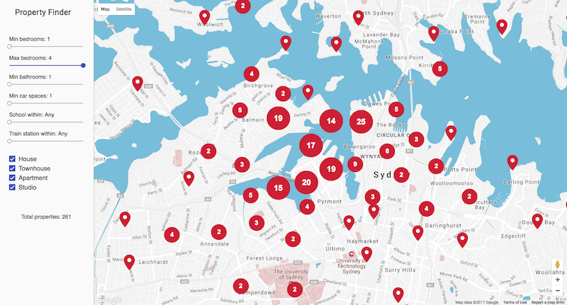

Property Finder
===============

This project implements a turnkey solution for a fictitious real estate business. It primarily consists of an SQL database with geospatial support (such as [PostgreSQL][postgresql] with the [PostGIS][postgis] extension), which is used to store property information that is then displayed on a map. The [Django framework][django] is used for the back-end, which provides excellent support for geospatial applications via its [GeoDjango][geodjango] extension.

Overview
--------

- Realtors enter the address of a new property via Django's admin interface, which is then sent to the [Google Maps Geocoding API][geocoding-api] for resolving its latitude and longitude.
- The school and train station nearest to the property are also also automatically determined, using the [Google Places API Web Service][places-api].
- The front-end consists of a map displaying properties using the [Google Maps JavaScript API][js-maps-api], and widgets for filtering the properties displayed, by distance to the nearest school or train station, or number of bathrooms and bedrooms, as entered by the realtor via the admin.
- All these attributes as well as the current viewport of the map are sent to the back-end, which queries the database and returns the filtered properties back to the front-end as [GeoJSON][geojson], which is then rendered onto the map using [Marker Clustering][marker-clustering] for enhanced usability.

   

Requirements
------------

The application can run in any environment that supports GeoDjango. [Google Cloud Platform][google-cloud] is one such environment, consisting of [Cloud SQL][cloud-sql] (which supports PostGIS) and [App Engine Flexible Environment][appengine-flex] for hosting, which allows custom libraries to be installed while still providing all the automation of [Google App Engine][appengine], such as versioned deployments, automatic scaling, monitoring, and much more.

Using Google Cloud certainly isn't a requirement, and if you'd like to manually set up the entire stack yourself, GeoDjango provides its own [detailed installation instructions][geodjango-install] which cover everything you'll need. Otherwise, below are the steps for getting up and running on Google Cloud Platform.

Google Cloud Setup
------------------

**Note:** You'll need to choose names for various things throughout these steps, such as the instance name for the database, the database name itself, and the username and password, as you create each of these components using the [Google Cloud SDK][cloud-sdk]. Make note of these as you go, as you'll need to copy these into the app's configuration at the end. Each of these `<look-like-this>` throughout the steps below.

- Create a [new Google Cloud Project][new-cloud-project], making note of the project ID
- Download and install the [Google Cloud SDK][cloud-sdk]
- Set the active project, using the project ID: `gcloud config set project <project-id>`
- Create a database instance (the server that will run your database), making up a name for the instance: `gcloud sql instances create <instance-name> --database-version=POSTGRES_9_6 --tier db-f1-micro --region=us-central`
- Create the database, specifying a new name for it, and the instance name too: `gcloud sql databases create <db-name> --instance=<instance-name>`
- Create the database user, specifying a new username and password: `gcloud sql users create <username> na --instance=<instance-name> --password=<password>`
- Enable the [Cloud SQL API][cloud-sql-api]
- Create an App Engine instance `gcloud app create --region=us-central`

Configuration and Deployment
----------------------------

- Clone the application's git repository: `git clone <todo: git URL> && cd property-finder`
- Get the connection string for the database: `gcloud sql instances describe <instance-name> | grep connectionName | cut -d ' ' -f 2`
- Update the file `mysite/local_settings.py`, entering the connection string, the database name, and the username and password from earlier, as well as setting the `SECRET_KEY` setting to random characters
- Create two [Google Maps API keys][create-key], restricting one of them to the HTTP referrer `<project-id>.appspot.com`, and leaving the other unrestricted, and then enter these into `mysite/local_settings.py`, as `GOOGLE_MAPS_API_WEB_KEY` and `GOOGLE_MAPS_API_SERVER_KEY` respectively
- Finally, in `app.yaml`, enter the connection string as well

You can now deploy the app with the following command: `gcloud app deploy -q`

Local Environment
-----------------

Presumably you'll want to customize the app to suit your needs, so here are the steps to run the application locally. Note that these are dependant on the previous setup steps using Google Cloud. Be aware that the local application will make use of the Cloud SQL database you just created and configured. You can also easily repeat those steps and create a Cloud SQL database specifically for your local development environment.

- Download and install the [Cloud SQL Proxy][cloud-sql-proxy]
- Run the proxy (in its own terminal): `./cloud_sql_proxy -dir=/cloudsql -instances=<connection-string>`
- Install GeoDjango's dependencies: `sudo apt-get install binutils libproj-dev gdal-bin` (That's the installation command on Debian/Ubuntu systems, for others, consult the [GeoDjango installation instructions][geodjango-install])
- Install the application's dependencies: `pip install -r requirements.txt`
- Run the application: `python manage.py runserver`

You can now view the local version of the application at <http://localhost:8000>, and the admin interface at <http://localhost:8000/admin>.

With all this in place, you can now run Django management commands against the currently configured Cloud SQL database:

- Create a superuser (for accessing the admin interface): `python manage.py createsuperuser`
- Populate the database with randomly generated (but real) addresses: `python manage.py populate_random` (Note this consumes many Google Places API queries, for more info run `python manage.py populate_random --help`)

[postgresql]: https://www.postgresql.org/
[postgis]: https://postgis.net
[django]: https://djangoproject.com
[geodjango]: https://docs.djangoproject.com/en/1.11/ref/contrib/gis
[geocoding-api]: https://developers.google.com/maps/documentation/geocoding
[places-api]: https://developers.google.com/places/web-service/search
[js-maps-api]: https://developers.google.com/maps/documentation/javascript/
[geojson]: http://geojson.org/
[marker-clustering]: https://github.com/googlemaps/v3-utility-library/tree/master/markerclusterer
[geodjango-install]: https://docs.djangoproject.com/en/1.11/ref/contrib/gis/install/
[google-cloud]: https://cloud.google.com
[cloud-sql]: https://cloud.google.com/sql/
[appengine-flex]: https://cloud.google.com/appengine/docs/flexible/
[appengine]: https://cloud.google.com/appengine/
[new-cloud-project]: https://console.cloud.google.com/projectcreate
[cloud-sdk]: https://cloud.google.com/sdk/
[cloud-sql-api]: https://console.cloud.google.com/apis/api/sqladmin.googleapis.com
[create-key]: https://console.developers.google.com/apis/credentials
[cloud-sql-proxy]: https://cloud.google.com/sql/docs/postgres/sql-proxy#install
